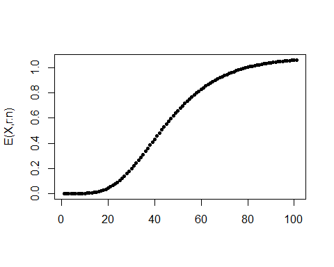

A Note on Explicit Expressions for Moments of Order Statistics - R code
================
Marcos A. C. Santos

R code used in “A Note on Explicit Expressions for Moments of Order
Statistics”, Spanish Journal Of Statistics, Vol. 3, 1,2021, paged 45-53

``` r
# General expression - power series s
# Input: vector of coefficients a0, a1,...a_{max} and a real number s 
# Return: vetor of the coefficientes c0,c1...c_{kmax}
ck.func=function(a,s){
    a0=a[1]
    C=a0^s  
    b=a[-1]
    m=length(b)
    for(j in 1:m){
        A=b[1:j]
        K=1:j
        cj=sum((1/(j*a0))*(K*s - j + K)*A*rev(C))
        C=c(C,cj)
    }
    return(C)
}
# usage
a=c(2,10,20) 
ck.func(a,s=2)  
```

    ## [1]   4  40 180

``` r
#---------------------------------------------
# coefficients bk of the cdf Gamma - version 1
bk=function(alpha,m){
    y=1/gamma(alpha + m + 1)       
    return(y)
}
# ----------------------------------------------------------------
# Given vetor of coefficients b_j, j=0,1,...return vector b_j^{(s)
bs.func=function(B,s){
    fsn=function(B,S){
        m=length(B)
        C=NULL
        for(k in 1:m){
            B2=B[1:k]
            S2=S[1:k]
            C= c(C,sum(S2*rev(B2)))
        }
        return(C)
    }
    BS=c(1, rep(0,length(B)-1)) # s=0
    if(s==0) return(BS)
    for (i in 1:s) {
        BS=fsn(B,BS)
    }
    return(BS)
}
```

Test - bd coefficients for some values

``` r
m=0:30          # index vector
alpha=6.402
x=0.5
B=bk(alpha,m)   # vector with b0, b1,...bm related to the Gamma expansion 
s=1
# according to b^(s) serie expansion
(exp(-x)*x^alpha)^s*sum(bs.func(B,s)*x^m)   
```

    ## [1] 4.968141e-06

``` r
# R method
pgamma(x,alpha,scale=1)^s
```

    ## [1] 4.968141e-06

``` r
s=2
(exp(-x)*x^alpha)^s*sum(bs.func(B,s)*x^m)     
```

    ## [1] 2.468243e-11

``` r
pgamma(x,alpha,scale=1)^s
```

    ## [1] 2.468243e-11

``` r
s=3
(exp(-x)*x^alpha)^s*sum(bs.func(B,s)*x^m)    
```

    ## [1] 1.226258e-16

``` r
pgamma(x,alpha,scale=1)^s
```

    ## [1] 1.226258e-16

$EX_{n:n}^k$ using b_j^{(s)}

``` r
j=0:80  # indices da serie
alpha=6.402
k=2
n=5 # sample size
B=bk(alpha,j)
X=bs.func(B,n-1)*gamma(alpha*n + j + k)/n^(n*alpha + k + j - 1)
EX=sum(X)/gamma(alpha)
EX
```

    ## [1] 96.37298

Checking convergence - visualization

``` r
A=NULL
v=1+ seq(0,max(j),1)
for(w in v){
    E=sum(X[1:w])/gamma(alpha)
    A=c(A,E)
}
plot(v,A, xlab="", ylab="E(X,r:n)", pch=19)
```

<!-- -->  
$E(Y^k,n,r)$ - expression 7 section 4

``` r
jmax=100  # index - max 
alpha=6.402
k=1
r=9
n=10 # sample size
EY=0
v=0:(n-r)
for(m in v){
    j=0:jmax
    B=bk(alpha,j)
    X=bs.func(B,m+r-1)*gamma(alpha*(m + r) + j + k)/(m+r)^(alpha*(m + r) + j + k)
    A=factorial(n)/(factorial(r-1)*factorial(n-r))
    EY= EY + A*(-1)^m*choose(n-r,m)*sum(X)/gamma(alpha)         
}
EY
```

    ## [1] 9.925815

Visualization - to check convergence only

``` r
A=NULL
v=1+ seq(0,max(j),1)
for(w in v){
    E=sum(X[1:w])/gamma(alpha)
    A=c(A,E)
}
plot(v,A, xlab="", ylab="E(X,r:n)", pch=20)
```

<!-- -->

``` r
k=1
n=10
# E(Y^k) by numeric integration  - gamma 
EXk_gamma=function(k,alpha){
    fun <- function(x) {x^k*dgamma(x, alpha)}
    r=integrate(fun, lower = 0, upper = Inf)
    return(as.numeric(r[1]))
}
EXk_gamma(k,alpha)
```

    ## [1] 6.402

``` r
# E(Y^k,n,n) by integration - gamma 
EXkn_gamma=function(k,alpha,n){
    fun <- function(x) {x^k*n*pgamma(x,alpha)^(n-1)*dgamma(x, alpha)}
    r=integrate(fun, lower = 0, upper = Inf)
    return(as.numeric(r[1]))
}
EXkn_gamma(k,alpha,n)
```

    ## [1] 10.80022

``` r
# E(Y^k,r,n) by integration - gamma 
EX_order_gamma=function(k,alpha,n,r){
    fun <- function(x) {
        a=factorial(n)/(factorial(r-1)*factorial(n-r))
        x=a*x^k*pgamma(x,alpha)^(r-1)*(1-pgamma(x,alpha))^(n-r)*dgamma(x,alpha)
    }
    r=integrate(fun, lower = 0, upper = Inf)
    return(as.numeric(r[1]))
}
EX_order_gamma(k,alpha,n,r=2)
```

    ## [1] 3.999244

<h3>
Tables
</h3>

``` r
#  E(Y^k,n,r)  Formula 7 seção 4
alpha=6.402
k=1
r=10
n=10 # tamanho da amostra
jmax = 20 # numero de termos
EXk_bs_gamma=function(alpha,k,n,r,jmax){
    EY=0
    v=0:(n-r)
    for(m in v){
        j=0:jmax
        B=bk(alpha,j)
        X=bs.func(B,m+r-1)*gamma(alpha*(m + r) + j + k)/(m+r)^(alpha*(m + r) + j + k)
        A=factorial(n)/(factorial(r-1)*factorial(n-r))
        EY= EY + A*(-1)^m*choose(n-r,m)*sum(X)/gamma(alpha)         
    }
    return(EY)
}
EXk_bs_gamma(alpha,k,n,r,jmax)
```

    ## [1] 0.5259832

``` r
# Table 2a
alpha=6.402
k=1
n=6
C0=C1=C2=C3=rep(" ",n)
for(r in 1:n){ 
    C1[r]=paste(r, "&", round(EXk_bs_gamma(alpha,k,n, r,jmax=60),4))
    C2[r]=paste(r, "&", round(EXk_bs_gamma(alpha,k,n, r,jmax=100),4))
    C3[r]=paste(r, "&",round(EX_order_gamma(k,alpha,n,r),4),"\\") # valores exatos
}
tabela=data.frame(jmax1=C1, jmax2=C2, exato=C3)
tabela
```

    ##        jmax1      jmax2         exato
    ## 1 1 & 3.6038 1 & 3.5882 1 & 3.5878 \\
    ## 2 2 & 4.5781 2 & 4.7153 2 & 4.7173 \\
    ## 3 3 & 6.0764 3 & 5.6749 3 & 5.6708 \\
    ## 4 4 & 6.1215 4 & 6.6589 4 & 6.6632 \\
    ## 5 5 & 8.2274 5 & 7.8864 5 & 7.8841 \\
    ## 6 6 & 9.8048 6 & 9.8884 6 & 9.8889 \\

``` r
# Table 2b
alpha=6.402
k=2
n=6
C0=C1=C2=C3=rep(" ",n)
for(r in 1:n){ 
    C1[r]=paste(r, "&", round(EXk_bs_gamma(alpha,k,n, r,jmax=60),4))
    C2[r]=paste(r, "&", round(EXk_bs_gamma(alpha,k,n, r,jmax=100),4))
    C3[r]=paste(r, "&",round(EX_order_gamma(k,alpha,n,r),4),"\\") # valores exatos
}
tabela=data.frame(jmax1=C1, jmax2=C2, exato=C3)
tabela
```

    ##          jmax1        jmax2           exato
    ## 1  1 & 14.1859   1 & 14.015  1 & 14.0062 \\
    ## 2  2 & 21.3902  2 & 23.3735  2 & 23.4198 \\
    ## 3  3 & 40.0213  3 & 33.5971  3 & 33.4992 \\
    ## 4  4 & 36.8939  4 & 45.9763  4 & 46.0795 \\
    ## 5  5 & 70.5991   5 & 64.628  5 & 64.5737 \\
    ## 6 6 & 101.2353 6 & 102.7357 6 & 102.7471 \\

``` r
# Table 3
alpha=6.402
k=1
n=10
C0=C1=C2=C3=rep(" ",n)
for(r in 1:n){ 
    C1[r]=paste("&", round(EXk_bs_gamma(alpha,k,n, r,jmax=60),4))
    C2[r]=paste("&", round(EXk_bs_gamma(alpha,k,n, r,jmax=106),4))
    C3[r]=paste("&", round(EX_order_gamma(k,alpha,n,r),4),"\\") # valores exatos
}
tabela=data.frame(jmax1=C1, jmax2=C2, exato=C3)
tabela
```

    ##        jmax1     jmax2        exato
    ## 1   & 3.0374   & 3.135  & 3.1301 \\
    ## 2    & 4.647  & 3.9855  & 3.9992 \\
    ## 3   & 4.2703  & 4.5887   & 4.656 \\
    ## 4    & 2.731  & 5.5752  & 5.2467 \\
    ## 5   & 7.7786   & 5.457  & 5.8255 \\
    ## 6  & 11.7461  & 6.0448  & 6.4285 \\
    ## 7   & 1.7441  & 8.4613  & 7.0954 \\
    ## 8   & 3.5427   & 6.474  & 7.8888 \\
    ## 9  & 16.1067  & 9.6251  & 8.9495 \\
    ## 10  & 8.4161 & 10.6734 & 10.8002 \\

``` r
# Table 1 - The first b_j^(s) coefficients
alpha=1
m=0:6
bk=function(alpha,m){
    y=1/gamma(alpha + m + 1)       # x ou m? CONFERIR
    return(y)
}
B=bk(alpha,m)
A=data.frame(i=m, bk=B)
for(s in m) A=cbind(A, bs.func(B,s))
round(as.matrix(A),6)
```

    ##      i       bk bs.func(B, s) bs.func(B, s) bs.func(B, s) bs.func(B, s)
    ## [1,] 0 1.000000             1      1.000000      1.000000      1.000000
    ## [2,] 1 0.500000             0      0.500000      1.000000      1.500000
    ## [3,] 2 0.166667             0      0.166667      0.583333      1.250000
    ## [4,] 3 0.041667             0      0.041667      0.250000      0.750000
    ## [5,] 4 0.008333             0      0.008333      0.086111      0.358333
    ## [6,] 5 0.001389             0      0.001389      0.025000      0.143750
    ## [7,] 6 0.000198             0      0.000198      0.006300      0.050017
    ##      bs.func(B, s) bs.func(B, s) bs.func(B, s)
    ## [1,]      1.000000      1.000000      1.000000
    ## [2,]      2.000000      2.500000      3.000000
    ## [3,]      2.166667      3.333333      4.750000
    ## [4,]      1.666667      3.125000      5.250000
    ## [5,]      1.012500      2.298611      4.529167
    ## [6,]      0.513889      1.406250      3.237500
    ## [7,]      0.225562      0.741733      1.989616
